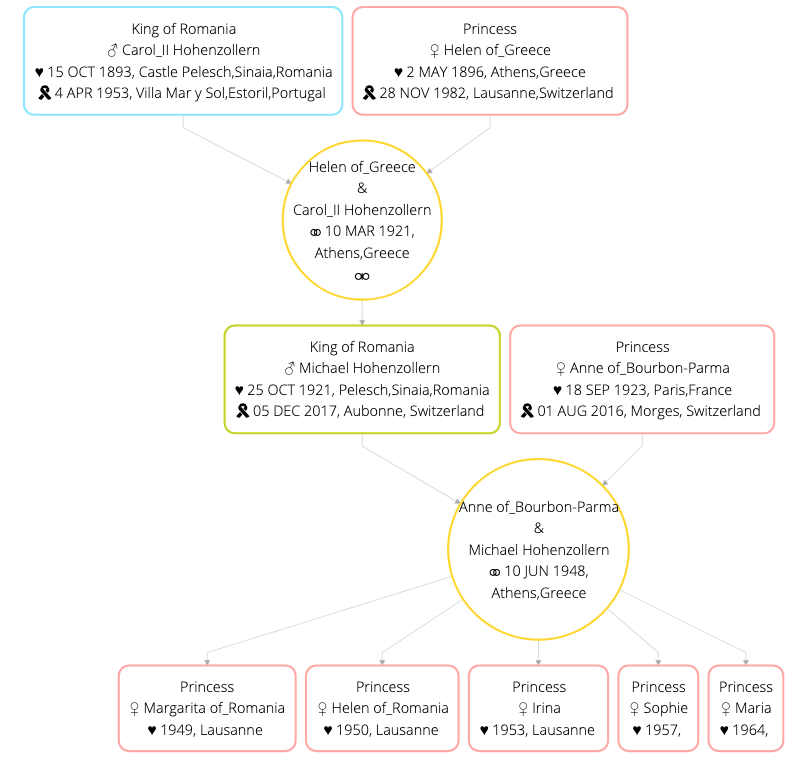

# gedcom-svg-tree
It is simple, yet UNIQUE way of presenting family tree. Each parents become a node of the tree.

## Purpose
The idea initially was as simple as:
- to visualize own family tree
- quite privately without passing data to any online system out there
- based on some file in a common format that the user can own independently of the system

This is a completely secure tool. Visualization is done on the client (your) side, in the browser, using JavaScript, without transferring data to any server.
There is no backend that holds, manipulate or process any data. It does not look for, match, examine, track or even collect any person data from your tree.

### Input
GEDCOM file (.ged) is the de facto standard for exchanging genealogical data between different software. It is a plain text file containing information
about individuals and links between them. It's specification is wide and eventually it is not ideal so the various systems expand it on their own.
You can read more about it on the Internet. We focus on some excerpt of it - the data suitable for visualization on the tree.

The tool makes use of such GEDCOM tags:
- NAME,
- TITL,
- SEX,
- BIRT,
- DEAT,
- HUSB,
- WIFE,
- MARR,
- BURI,
- FAMC,
- FAMS,
- CHIL,
- SURN,
- GIVN,
- NICK,
- DATE,
- PLAC

Its does however try to display all the data from the file.

### Output
SVG is a universal format of two-dimensional vector graphics, which was created for use on WWW.

The tool uses SVG to visualize the tree and allows to save the generated graphics as a .svg file so that the user can freely use it.

## HOW TO USE IT
- Just go to [live version](https://ameros.github.io/gedcom-svg-tree/) (or choose [its polish version](https://ameros.github.io/gedcom-svg-tree/?lang=pl)) and open the GEDCOM file

## Dependencies and Credits
After some research:
- GEDCOM (5.5.1) as a de facto standard to store family tree data https://en.wikipedia.org/wiki/GEDCOM
- D3.js to draw a tree in a browser https://d3js.org/
- DAG to display parents as a node https://en.wikipedia.org/wiki/Directed_acyclic_graph
    - instead of typical data tree that can have only one parent
    - instead of typical family trees that display parents separately, only as a relation 
- dagre-d3 to draw DAG https://github.com/dagrejs/dagre-d3
