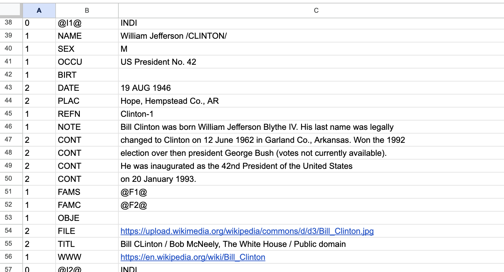

# gedcom-svg-tree
It is simple, yet UNIQUE way of presenting family tree. Each parents become a node of the tree.


## Purpose
The idea initially was as simple as:
- to visualize own family tree
- quite privately without passing data to any online system out there
- based on some file in a common format that the user can own independently of the system

This is a completely secure tool. Visualization is done on the client (your) side, in the browser, using JavaScript, without transferring data to any server.
There is no backend that holds, manipulate or process any data. It does not look for, match, examine, track or even collect any person data from your tree.

## HOW TO USE IT
- Just go to [live version](https://ameros.github.io/gedcom-svg-tree/) (or choose [its polish version](https://ameros.github.io/gedcom-svg-tree/?lang=pl)) and open the GEDCOM file
- or just [download lastest version](https://github.com/ameros/gedcom-svg-tree/releases/latest) and open with your browser

### EXAMPLES
- [Piast Dynasty](https://ameros.github.io/gedcom-svg-tree/?lang=pl&ged) - with `lang=pl`
- [USA Presidents](https://ameros.github.io/gedcom-svg-tree/?ged=usa&id=I1604) - showing images from relative path _(data folder)_
- [Royal Families](https://ameros.github.io/gedcom-svg-tree/?ged=royals)

---

## SPECS

### Input
GEDCOM file (.ged) is the de facto standard for exchanging genealogical data between different software. It is a plain text file containing information
about individuals and links between them. It's specification is wide and eventually it is not ideal so the various systems expand it on their own.
You can read more about it on the Internet. We focus on some excerpt of it - the data suitable for visualization on the tree.

The tool makes use of such GEDCOM records and tags:
- INDI: 
  - BIRT
    - DATE
    - PLAC
  - BURI
    - PLAC
  - DEAT
    - DATE
    - PLAC
  - FAMC
  - FAMS
  - GIVN
  - NAME
  - NICK
  - OCCU
  - SEX
  - SURN
  - TITL
- FAM:
  - CHIL
  - HUSB
  - MARR
    - DATE
    - PLAC
  - WIFE
  - DIV

It does however try to display all the data of those records.

### Output

#### SVG
SVG is a universal format of two-dimensional vector graphics, which was created for use on WWW.

The tool uses SVG to visualize the tree and allows to save the generated graphics as a .svg file so that the user can freely use it.

#### TSV
TSV is a tab-separated values file, convenient for a spreadsheet use. The GEDCOM level, pointer / tag and value are separated by tab character.  

After import to spreadsheet using tab separator it looks like this:



#### JSON
JSON, used as intermediate format while parsing GEDCOM file and building a tree, is also exposed
for download as possible benefit for developers. Sample:

```json
{
  "HEAD": {},
  "I1": {
    "nfType": "INDI",
    "nfRecord": "0 @I1@ INDI",
    "NAME": {
      "nfValue": "William Jefferson /CLINTON/",
      "nfRecord": "1 NAME William Jefferson /CLINTON/"
    },
    "SEX": {
      "nfValue": "M",
      "nfRecord": "1 SEX M"
    },
    "OCCU": {
      "nfValue": "US President No. 42",
      "nfRecord": "1 OCCU US President No. 42"
    },
    "BIRT": {
      "nfValue": "",
      "nfRecord": "1 BIRT",
      "DATE": {
        "nfValue": "19 AUG 1946",
        "nfRecord": "2 DATE 19 AUG 1946"
      },
      "PLAC": {
        "nfValue": "Hope, Hempstead Co., AR",
        "nfRecord": "2 PLAC Hope, Hempstead Co., AR"
      }
    },
    "REFN": {
      "nfValue": "Clinton-1",
      "nfRecord": "1 REFN Clinton-1"
    },
    "NOTE": {
      "nfValue": "Bill Clinton was born William Jefferson Blythe IV. His last name was legally",
      "nfRecord": "1 NOTE Bill Clinton was born William Jefferson Blythe IV. His last name was legally",
      "CONT": [
        {
          "nfValue": "changed to Clinton on 12 June 1962 in Garland Co., Arkansas. Won the 1992",
          "nfRecord": "2 CONT changed to Clinton on 12 June 1962 in Garland Co., Arkansas. Won the 1992"
        },
        {
          "nfValue": "election over then president George Bush (votes not currently available).",
          "nfRecord": "2 CONT election over then president George Bush (votes not currently available)."
        },
        {
          "nfValue": "He was inaugurated as the 42nd President of the United States",
          "nfRecord": "2 CONT He was inaugurated as the 42nd President of the United States"
        },
        {
          "nfValue": "on 20 January 1993.",
          "nfRecord": "2 CONT on 20 January 1993."
        }
      ]
    },
    "FAMS": [
      {
        "nfValue": "F1",
        "nfRecord": "1 FAMS @F1@"
      }
    ],
    "FAMC": {
      "nfValue": "F2",
      "nfRecord": "1 FAMC @F2@"
    },
    "OBJE": {
      "nfValue": "",
      "nfRecord": "1 OBJE",
      "FILE": {
        "nfValue": "https://upload.wikimedia.org/wikipedia/commons/d/d3/Bill_Clinton.jpg",
        "nfRecord": "2 FILE https://upload.wikimedia.org/wikipedia/commons/d/d3/Bill_Clinton.jpg"
      },
      "TITL": {
        "nfValue": "Bill CLinton / Bob McNeely, The White House / Public domain",
        "nfRecord": "2 TITL Bill CLinton / Bob McNeely, The White House / Public domain"
      }
    },
    "WWW": {
      "nfValue": "https://en.wikipedia.org/wiki/Bill_Clinton",
      "nfRecord": "1 WWW https://en.wikipedia.org/wiki/Bill_Clinton"
    }
  },
  "I2": {},
  "F1": {}
}

```
where:
  - `nfType`, `nfRecord` and `nfValue` are this tool native markers as a primal split of each GEDCOM line
  - `I1`, `I2`, `F1`... etc are the actual record pointers _(id / reference)_

---

## Dependencies and Credits
After some research:
- GEDCOM (5.5.1) as a de facto standard to store family tree data https://en.wikipedia.org/wiki/GEDCOM
- D3.js to draw a tree in a browser https://d3js.org/
- DAG to display parents as a node https://en.wikipedia.org/wiki/Directed_acyclic_graph
    - instead of typical data tree that can have only one parent
    - instead of typical family trees that display parents separately, only as a relation 
- dagre-d3 to draw DAG https://github.com/dagrejs/dagre-d3
- lunr.js for searching https://lunrjs.com/

---

The tool is listed @ https://www.cyndislist.com/gedcom/gedcom-software/.

Here you can add a link to the list: http://www.cyndislist.com/create-a-link-to-cyndis-list/
